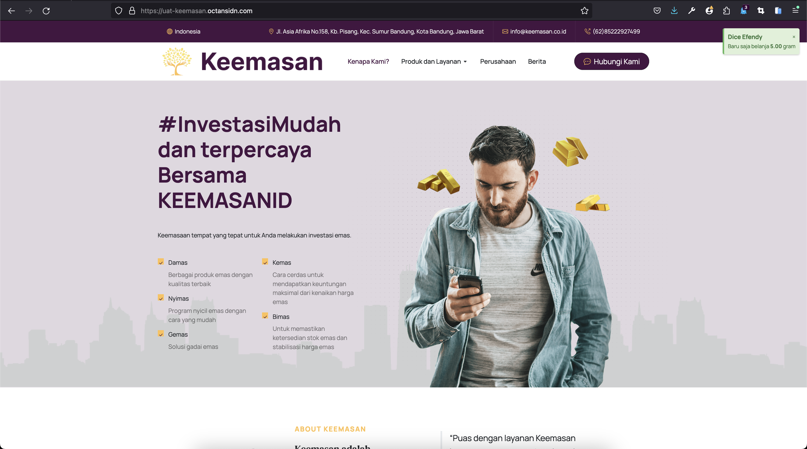
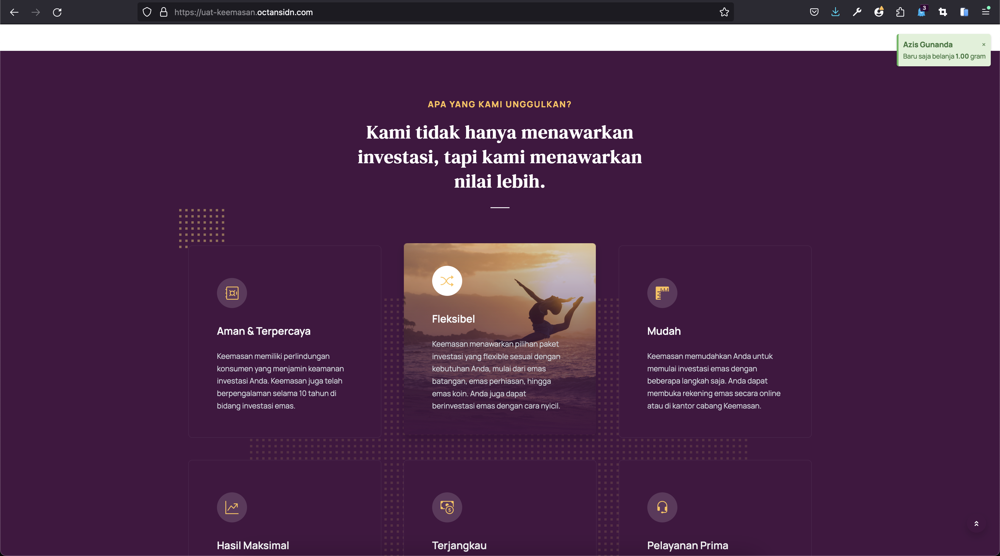
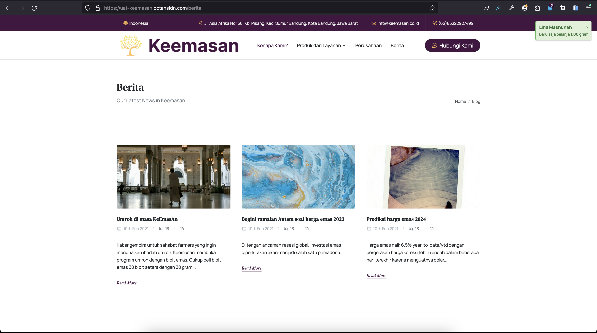
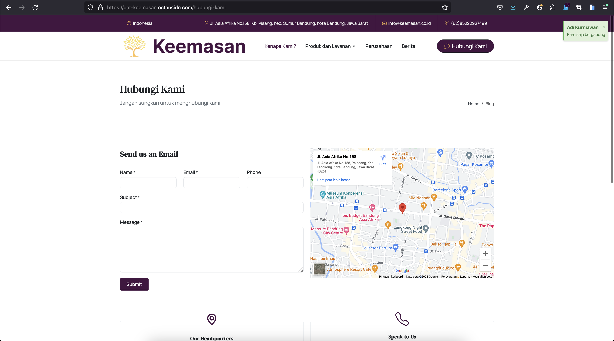

# Keemasan

This is the web application for [uat-keemasan.octansidn.com](https://uat-keemasan.octansidn.com).

## Description

Investasi Emas Mudah dan Terpercaya Bersama Keemasan yang telah berpengalaman selama lebih dari 10 tahun.

## Installation

To set up the project on your local machine, follow these steps:

```bash
# Clone the repository
git clone https://github.com/bintangjtobing/keemasan.git

# Go into the project directory
cd repository

# Install dependencies
composer install

# Copy .env.example to .env
cp .env.example .env

# Generate application key
php artisan key:generate

# Run database migrations (Set the database connection in .env before migrating)
php artisan migrate

# Start the local development server
php artisan serve

# You can now access the server at http://localhost:8000
```

## Screenshots of projects





